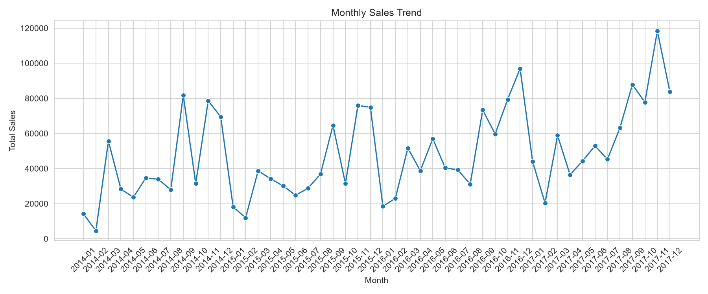
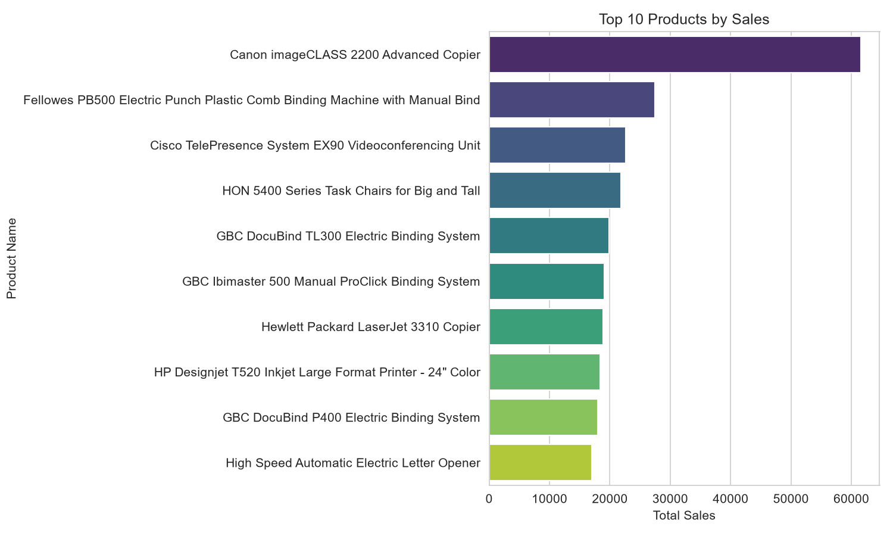
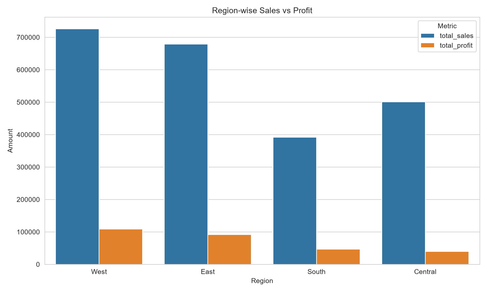
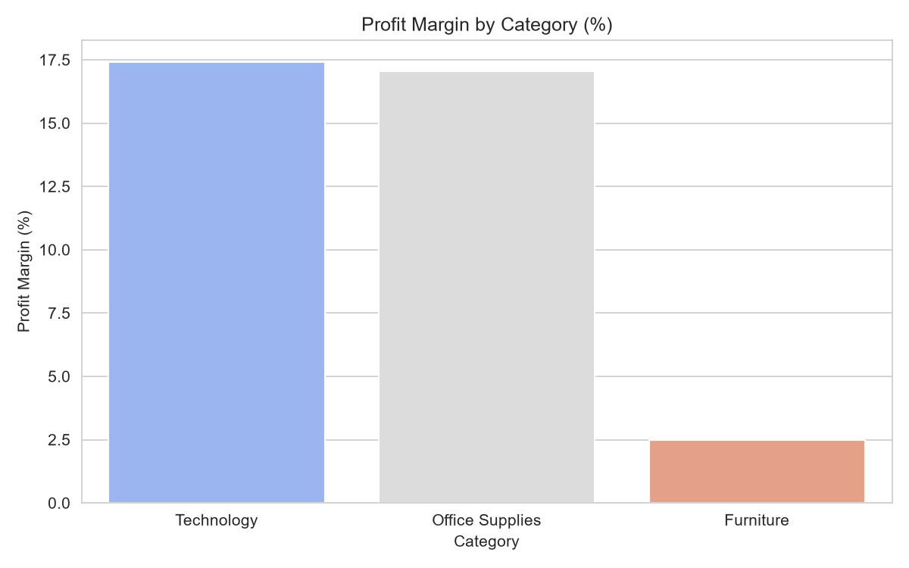

# 📊 Retail Sales Data Analysis

A complete data analysis project that digs into a retail store's sales history to answer real business questions: *Which products sell best? Which regions make the most money? When do sales peak? And where is the business losing profit?*

---

## 🎯 What This Project Does (In Simple Terms)

Imagine you run a retail store with thousands of orders over several years. You have all the sales data, but raw numbers in a spreadsheet don't tell you much on their own.

This project takes that raw data and turns it into **clear answers and visual charts**, such as:
- Which month of the year brings in the most sales
- Which products are best-sellers
- Which regions are most profitable
- Which product category is actually losing the business money

The end goal is to turn raw data into **actionable business recommendations** — the kind of insight a manager could use to make real decisions.

---

## 📂 Dataset

**Source:** [Superstore Dataset (Kaggle)](https://www.kaggle.com/datasets/vivek468/superstore-dataset-final)

This is a real-world style dataset of retail orders, containing information like:
| Column | What it means |
|---|---|
| Order Date | When the order was placed |
| Region | Where the customer is located (West, East, South, Central) |
| Category | Type of product (Furniture, Technology, Office Supplies) |
| Product Name | The specific item sold |
| Sales | Revenue from that order |
| Profit | Profit (or loss) made from that order |
| Quantity | Number of units sold |

---

## 🛠️ Tools Used

| Tool | Purpose |
|---|---|
| **Python (pandas)** | Cleaning and organizing the raw data |
| **SQLite** | Storing the data like a mini database, so it can be queried with SQL |
| **SQL** | Asking specific business questions (e.g. "which region is most profitable?") |
| **Matplotlib / Seaborn** | Turning numbers into charts and graphs |
| **Jupyter Notebook (VS Code)** | Writing and running the code step by step |
| **Git & GitHub** | Saving progress and sharing the project publicly |

---

## 🔍 Project Workflow

1. **Data Cleaning** — Checked the data for missing values and duplicate rows (none were found), fixed the date format, and cleaned up column names.
2. **Database Setup** — Loaded the cleaned data into a SQLite database so it could be queried using SQL, just like a real business database.
3. **SQL Analysis** — Wrote SQL queries (found in [`sql/queries.sql`](sql/queries.sql)) to answer specific business questions.
4. **Visualization** — Turned each SQL result into an easy-to-read chart.
5. **Insights & Recommendations** — Interpreted each chart in plain language and turned it into practical business advice.

---

## 📈 Key Findings

### 1. Monthly Sales Trend


**What it shows:** Total sales for every month from 2014 to 2017.

**Insight:** Sales grow steadily year over year, with a clear spike every **November–December** — most likely driven by holiday season shopping.

---

### 2. Top 10 Best-Selling Products


**What it shows:** The 10 products that generated the most total sales.

**Insight:** The **Canon imageCLASS 2200 Advanced Copier** is by far the best-seller (~$62,000 in sales) — well ahead of everything else. Office equipment and binding machines dominate the top 10.

---

### 3. Region-wise Sales vs Profit


**What it shows:** Total sales and profit compared across the four regions.

**Insight:** The **West region** leads in both sales and profit. Interestingly, the **South region** has lower sales than Central, but earns a similar amount of profit — suggesting the South is more efficient at converting sales into profit.

---

### 4. Profit Margin by Product Category


**What it shows:** What percentage of each category's sales actually becomes profit.

**Insight:** **Furniture** has a very low profit margin (~2.5%) compared to Technology and Office Supplies (both above 17%) — meaning Furniture sells well but barely makes money.

---

## 💡 Business Recommendations

1. **Fix Furniture's pricing or discounting.** Its sales are decent, but the profit margin is far too thin — either prices need to rise slightly or discounts need to be reduced.
2. **Learn from the West region.** Whatever pricing, marketing, or operational strategy is working there should be studied and applied to weaker regions like Central and South.
3. **Prepare inventory for the Nov–Dec rush.** Since this spike repeats every year, stock levels and staffing should be planned in advance for the holiday season.
4. **Push top-selling products in underperforming regions.** Products like the Canon copier are proven winners — promoting them more in low-performing regions could boost overall sales.

---

## 🚀 How to Run This Project Yourself

If you'd like to explore or re-run this analysis on your own machine:

### Step 1: Clone the repository
```bash
git clone https://github.com/sh-nipun/retail-sales-analysis.git
cd retail-sales-analysis
```

### Step 2: Install the required Python libraries
```bash
pip install pandas numpy matplotlib seaborn jupyter openpyxl
```

### Step 3: Open the notebook
Open `notebooks/analysis.ipynb` in VS Code (with the Jupyter extension) or in Jupyter Notebook.

### Step 4: Run the cells
Run each cell from top to bottom — the notebook will clean the data, build the database, run the SQL queries, and generate all the charts automatically.

---

## 📁 Project Structure